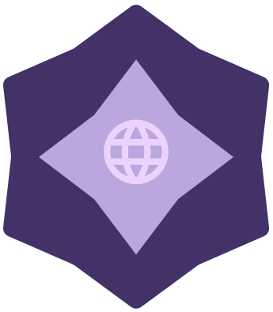
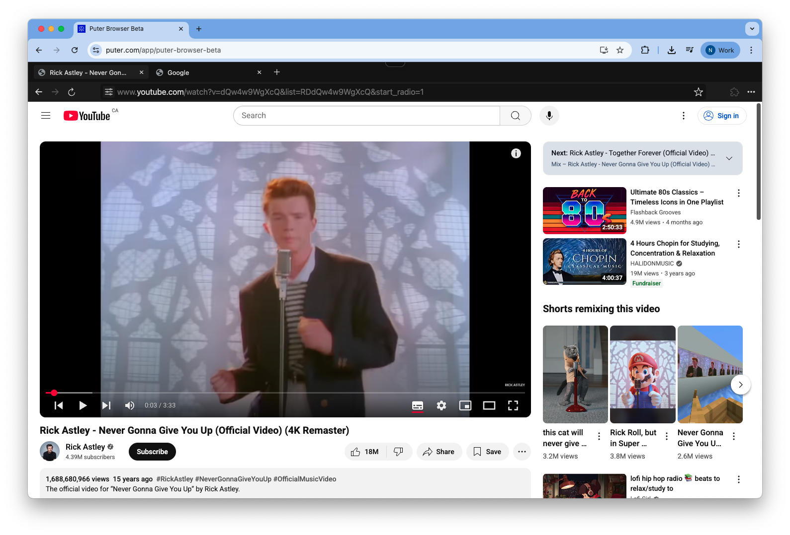

<h3 align="center"></h3>

<h3 align="center">Highly Configurable Browser Environment for the Web</h3>

	
<h3 align="center"></h3>

 

# EdgeLast

"The Ultimate Proxy!", A really good Browser Proxy to escape Censoring.

It can be used as:

- An end-to-end encrypted, cloud-based browser accessible from any device at anytime
- A headless browser that can be embedded in other websites and applications
- A fast, lightweight, and no-installation alternative to Puppeteer, Playwright, and Selenium
- An alternative to Ultraviolet, Rammerhead, and other web proxy browsers

 

## License

This repository, including all its contents, sub-projects, modules, and components, is licensed under [AGPL-3.0](https://github.com/HeyPuter/puter/blob/main/LICENSE.txt) unless explicitly stated otherwise. Third-party libraries included in this repository may be subject to their own licenses.

 
